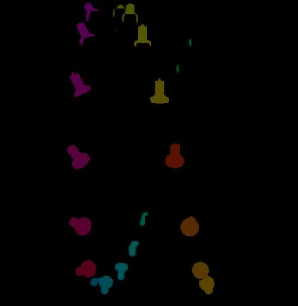

1. # **ТЕХНОЛОГИЧЕСКАЯ ЧАСТЬ**
   ## **1.1 СОЗДАНИЕ ГЕНЕРАТОРА СИНТЕТИЧЕСКИХ ИЗОБРАЖЕНИЙ**
   ### **1.1.1 СОЗДАНИЕ МОДЕЛИ ШНЕКА И ДЕРЖАТЕЛЕЙ РЕЗЦОВ**
   Для того, чтобы построить автоматизированную систему диагностики рабочего органа необходимо иметь достаточно большую выборку изображений, на которой можно бы было обучить алгоритм. Из-за отсутствия возможности получить такие изображения непосредственно с шнека добычного комбайна на производстве было принято решение сгенерировать изображения шнека с резцами с необходимым ракурсом, получив таким образом синтетический набор данных. Такой подход имеет преимущество в виде получения теоретически неограниченного по количеству изображений датасета с необходимыми параметрами освещения, положения камеры в пространстве и параметрами износа, которые может и невозможно получить в реальных условиях, покрыв тем самым большое количество условий. Недостатком такого подхода является, что репрезентабельность таких изображений прямо зависит от навыков в моделировании и учете неочевидных факторов.

   Было принято решение, что моделирование рабочего органа, а также рендер изображений с его участием необходимо производить в ПО для 3D-моделирования с открытым исходным кодом Blender 3.4.

   Для того, чтобы алгоритм работал корректно необходимо предоставлять ему такие изображения, которые бы кроме самого объекта несли информацию о контексте, в котором находится объект для диагностики. С этой целью были построены модель шнека и модель резцедержателя, представленные на рисунках соответственно.

   

   Рисунок 1. Построенная модель шнека

   

   Рисунок 2. Построенная модель резцедержателя для тангенциального резца

   Внутрь резцедержателя был вставлен хвостовик резца и на поверхности хвостовика указана контрольная точка, куда в дальнейшем будет вставляться головная часть резца

   

   Рисунок 3. Хвостовик внутри резцедержателя (выделено желтым)

   На построенной модели шнека были указаны контрольные точки для расположения каждого резцедержателя. В конце на шнек равномерным образом были распределены резцедержатели с хвостовиками.

   

   Рисунок 4. Шнек со вставленными резцедержателями
   ### **1.1.2 СОЗДАНИЕ МОДЕЛИ РЕЗЦА**
   В качестве референса головных частей резцов были использованы сечения с рисунка

   

   Рисунок 5. Формы головной части тангенциального резца: С – скругление или криволинейный участок размером более 3-4 мм; Сф – фаска в виде скругления или кривой линии размером более 3-4 мм; К – конусный участок; Кф – коническая фаска; Ц – цилиндрический участок; В – выпуклая

   С помощью скрипта на языке Python и библиотеки OpenCV с рисунка были убраны подписи, каждое сечение было поделено пополам. Далее, каждое сечение было импортировано в Blender, по нему построена NURBS-кривая, которая затем была переведена в NURBS-поверхность с помощью вращения вокруг своей оси и эта поверхность была переведена в объект типа Mesh.

   

   Рисунок 6. Mesh-объект на примере резца типа «Выпуклый коноид»

   Модель твердосплавной вставки резца состоит из двух частей, одна из которых участвует в износе, а вторая нет. Эти части вставляются в модель головной части резца. Таким образом получилась коллекция эталонных моделей головных частей резцов со вставками.

   

   Рисунок 7. Модель твердосплавной вставки (изнашиваемая часть выделена желтым)

   Из полученной коллекции для рендера одного изображения берется одна эталонная модель, которая проходит через процесс преобразований в изношенный резец и именно он в дальнейшем копируется и расставляется по контрольным точкам хвостовиков.

   

   Рисунок 8. Пример расстановки резцов по контрольным точкам хвостовиков
   ### **1.1.3 ФОРМУЛА ИЗНОСА РЕЗЦА**
   Износ резца осуществляется за счёт изменения координат узлов объекта Mesh в зависимости от данных переменных, в общем виде:

   `	`meshweared=f(meshbase;WR;H)	(1)

   где meshweared – модель изношенного резца (объект Mesh); meshbase – эталонная модель резца; WR – общая величина износа резца, имитирующая количество работы резца; H – высота, с которой начинается износ резца.

   WR может принимает значения от 0 до 2 с данным шагом; если значения больше 1, то имитируется ситуация выпадения вставки из головной части резца. H может принимать значение от 0 до 1, что представляет собой относительную высоту резца.

   meshbase – состоит из множества узлов, представляющих собой кортежи с пространственными координатами (xi; yi; zi). Сама функция износа изменяет именно эти координаты таким образом, что:

   `	`xweared:i=xi\*(bias-WR\*t(scale(zi;H))):zi≥Hyweared:i=yi\*(bias-WR\*t(scale(zi;H))):zi≥H 	(2)

   Где bias – ровно единице и обозначает смещение, относительно которого надо рассчитывать смещение; t(z) – функция, которая обозначает характер изменения величины износа для данной координаты zi (может быть tzi=zi, tzi=zi2, tzi=zi, tzi=ezi); scale(zi;H)=H+zi\*(1-H) – функция масштабирования координаты относительно заданной высоты износа.

   

   Рисунок 9. Иллюстрация к формуле (2)
   ### **1.1.4 РЕНДЕР ИЗОБРАЖЕНИЙ**
   С целью создания большего контекста изображения была создана сцена, имитирующая угольную шахту.

   

   Рисунок 10. Задний фон для изображений

   Конечное изображение имеет следующий вид:

   

   Рисунок 11. Срендеренное изображение

   Настройки камеры приведены в таблице 1

   Таблица 1 – Параметры виртуальной камеры

<table>   <tr><th valign="top">
Таблица 1. Параметры виртальной камеры

Параметр
</th><th valign="top">Тип</th><th valign="top">Перспективная</th></tr>
   <tr><td rowspan="3" valign="top">Линза</td><td valign="top">Фокусное расстояние линзы</td><td valign="top">50 мм</td></tr>
   <tr><td valign="top">Расстояние, с которого объекты попадают на камеру</td><td valign="top">0,1 м</td></tr>
   <tr><td valign="top">Расстояние, до которого объекты попадают на камеру</td><td valign="top">100 м</td></tr>
   <tr><td valign="top">Глубина изображения</td><td valign="top">Длина фокусного расстояния</td><td valign="top">1,5 м</td></tr>
   <tr><td rowspan="2" valign="top">Апертура</td><td valign="top">Относительное отверстие объектива</td><td valign="top">2\.8</td></tr>
   <tr><td valign="top">Количество лезвий</td><td valign="top">5</td></tr>
   <tr><td rowspan="3" valign="top">Камера </td><td valign="top">Поле зрения</td><td valign="top">Горизонтальное</td></tr>
   <tr><td valign="top">Ширина</td><td valign="top">36 мм</td></tr>
   <tr><td valign="top">Высота</td><td valign="top">24 мм</td></tr>
   <tr><td rowspan="2" valign="top">Размер изображения</td><td valign="top">Высота</td><td valign="top">1080 пикселей</td></tr>
   <tr><td valign="top">Ширина</td><td valign="top">1080 селей</td></tr>
</table>

   ### **1.1.5 РАЗМЕТКА ИЗОБРАЖЕНИЙ**
   Для возможности обучить алгоритм находить на изображении нужные координаты изображений необходимо разметить каждое изображение так, чтобы были указаны относительные координаты резцов в изображении и их износ. С этой целью после рендера основного изображения генерируются ещё два изображения: бинарная маска, в которой выделены принадлежащие резцу и бинарная маска с цветовой градацией, чтобы по оттенку цвета выделить отдельные резцы, которые могут перекрывать друг друга. Бинарная и цветовая маски представлены на рисунках соответственно.

   

   Рисунок 12. Бинарная маска изображения

   

   Рисунок 13. Цветовая маска изображения

   В результате алгоритму для обучения будут переданы само изображение и файл с координатами. Координаты имеют структуру (x,y,w,h), где x, y – координаты центра положения резца, а w, h – ширина и высота области положения

   

   Рисунок 14. Пример выделения положения резцов на бинарной маске

   Обучение алгоритма будет производиться на платформе Google Colab, соответственно, чтобы уменьшить скорость чтения изображения алгоритмом рендеры и файлы с координатами резцов на изображении будут передаваться в облачное хранилище Google Drive.
   ## **1.2 ОБУЧЕНИЕ АЛГОРИТМА**
   ### **1.2.1 АРХИТЕКТУРА МОДЕЛИ ОБНАРУЖЕНИЯ**
   Наиболее популярными архитектурами для решения задачи обнаружения объектов на изображении являются U-NET, Selective Search, R-CNN, Fast R-CNN и YOLO (<https://cyberleninka.ru/article/n/modeli-neyronnoy-seti-dlya-obnaruzheniya-obektov/viewer>). Для данной работы была выбрана архитектура YOLO версии 5 (<https://github.com/ultralytics/yolov5>), одним из главных преимуществ которой является то, что в отличии от, например, U-NET она не сегментирует изображение, т.е. не присваивает каждому пикселю метку определенного класса; данная архитектура проходит изображение один раз и выводит не само изображение, а координаты объектов, что ускоряет вывод модели. 

   

   Рисунок 15. Архитектура YOLO 5 версии

   Кроме того, компания Ultralytics обучила данную архитектуру на датасете COCO компании Microsoft, состоящего из более чем 330 тысячи изображений, и предоставила отрытый доступ к обученной модели. Данное решение имеет несколько реализаций, отличающихся друг от друга размером самой сети, точностью и быстродействием.

   

   Рисунок 16. Сравнение производительности моделей архитектуры YOLO компании Ultralytics.
   ### **1.2.2 ОБУЧЕНИЕ МОДЕЛИ ОБНАРУЖЕНИЯ**
   В качестве рабочей модели была выбрана YOLOv5s6, т.к. Чтобы использовать готовое решение, необходимо произвести transfer learning, т.е. сделать так, чтобы при обучении нижние начальные слои сети не изменялись, т.к. они отвечают за выделение первичных признаков на изображении (градиенты пикселей на изображении для выделения границ, отделение заднего фона и пр. признаки, которые не всегда могут поддаться корректной интерпретации, однако, играющие важную роль в работе модели). Поэтому, первые 10 слоев были отмечены как необучаемы, т.е. веса в этих слоях не менялись и для них не рассчитывались соответствующие градиенты. Данный подход кроме того имеет преимущество перед обучением сети с нуля экономией времени.

   Данные рендера, полученные из программы Blender, были загружены на Google Drive, откуда и была запущена программа для обучения. Перед запуском обучения изображения и соответствующие аннотации с указанием координат резцов на изображении были поделены на обучающую, тестовую и валидационную выборку в пропорциях 60%, 20% и 20% соответственно. Обучающая выборка необходима для непосредственного процесса обучения, т.е. изменение весов в сети в зависимости от вывода модели и истинных данных; здесь изображения могут подвергаться дополнительным изменениям, таким как поворот изображения, его зашумление, изменение яркости и контрастности и т.д.. Тестовая выборка используется для оценки качества обучения, но при этом веса не изменяются, т.е. эти данные являются поверочными и если динамика метрик не совпадает, то это свидетельствует о некорректной настройке гиперпараметров алгоритма. Валидационная выборка используется в самом конце, как правило в качестве демонстрации работы.

   Для обучения при выводе модели используется метрики, отвечающие за качество работы алгоритма: box loss и object loss – ошибка, показывающая правильность определения координат положения объекта, и ошибка, показывающая то, правильно ли алгоритм определил, что в данных координатах присутствует какой-либо объект вообще.

   На рисунках показана динамика данных метрик для последнего, наиболее верного обучения.

   

   Рисунок 17. Графики динамики значений функций ошибки при обучении

   Данные графики говорят о том, что за 20 эпох обучения метрики не вышли на плато, значит, обучение модели можно было бы продолжить, однако уже на этом этапе результаты получились достаточно достоверными. Динамика метрик на валидационной выборке показывает результаты, схожие с обучающей.

   

   Рисунок 18. Графики динамики значений функций ошибки при тестировании

   При заданном уровне уверенности алгоритмом в обнаружении (confidence threshold), равному 0.8 были получены данные результаты.

   

   Рисунок 19. Пример работы алгоритма на данных обучающей выборки
   ### **1.2.3 ОБУЧЕНИЕ МОДЕЛИ ОПРЕДЕЛЕНИЕ СОСТОЯНИЯ РЕЗЦА**
   Для обучения алгоритма определения износа была использована архитектура, аналогичная 1 версии YOLO, но с уменьшенным количеством признаков, т.к. размеры изображения резцов, полученные от алгоритма обнаружения, будут в среднем в 10 раз меньше, чем те, которые были изначально. Архитектура представлена на рисунке.

   

   Рисунок 20. Архитектура алгоритма определения износа

   На вход данному алгоритму кроме самого изображения резца подается также информация о координатах резца на оригинальном изображени, тем самым давая дополнительную информацию, которую может использовать алгоритм.

   Как и для алгоритма обнаружения исходные данные, представляющие собой вырезки из оригинального изображения и соотвтсвующие аннотации, были разделены на обучающую, тестовую и валидационную выборку в пропорциях, аналогичным при обучении алгоритма обнуражения.

   В качестве метрики работы алгоритма (функции ошибки) использовалась среднеквадратичная ошибка

   На рисунке показаны результаты метрик в процессе оценки на тестовой выборке.

   

   Рисунок 21. Динамика функций ошибок при валидации

   Согласно данному графику наилучшим результатом обладала модель с тегом test/1\_lr:2e-05;bs:8;wd:0, т.к. она не переобучена и значние функции ошибки не возросло резко после определенной эпохи, как это произшло с другим запускаом программы. 
   ### **1.2.4 РАЗРАБОТКА ЕДИНОЙ ПРОГРАММЫ ДЛЯ ОЦЕНКИ РАБОТЫ**
   Для взаимодействия с полученными алгоритмами и визуальной оценки их работы была разработана веб-страница с фильтрами, которые позволяют указать необходимые для анализа изображения, и блоками изображений с их аннотациями.

   Блок-схема работы программы показана на рисунке

   

   Рисунок 22. Блок-схема программы для взаимодействия с алгоритмами

   На рисунке показана страница, демонстрирующая анализ данного изображения. В таблице с зеленым заголовком указаны данные, которые были сгенерированы при рендере, а в таблице с красным заголовком показаны аннотации, данные двумя алгоритмами.

   

   Рисунок 23. Интерфейс программы для анализа работы программ

