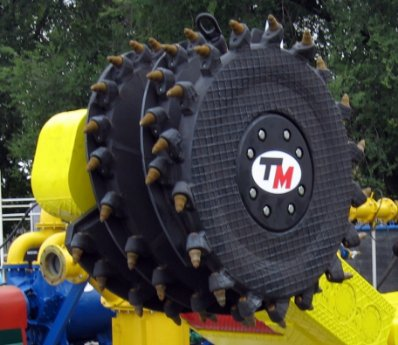
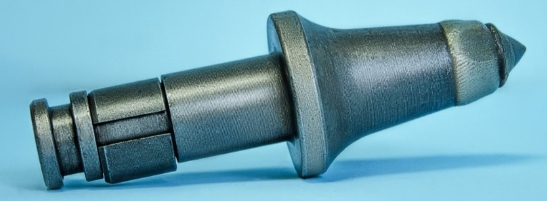
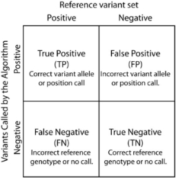
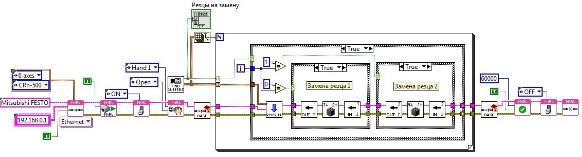

**АННОТАЦИЯ**

В ходе выполнения выпускной работы была построена система автоматизированной диагностики рабочего органа добычного комбайна на основе технического зрения. В технологической части рассмотрен процесс определения непригодных к эксплуатации резцов и способы их замены. В специальной части в программной среде LabVIEW с использованием модуля Vision Development был разработан алгоритм обработки входящего с камеры изображения и нахождения на нём резцов рабочего органа с последующим определением их положения в пространстве. Произведен расчет коэффициентов, производящих перевод полученных координат положения на изображении в пространственные координаты робота. В разделе «Безопасность жизнедеятельности» произведен анализ вредных и опасных факторов производства, а также организации охраны труда. 

Выпускной проект содержит пояснительную записку объемом 60 страниц, включающую 6 таблиц и 62 рисунков.

**ANNOTATION**

In the course of the research described in the present paper, a system for automated diagnostics of the working body of a mining combine based on technical vision was built. In the technological part, the process of determining unserviceable cutters and methods of replacing them are discussed. In the specialized part, the author substantiates in the LabVIEW software environment, using the Vision Development module, an algorithm for processing the image coming from the camera and finding the cutters of the working body on it, followed by determining their position in space. The calculation of the coefficients producing the translation of the obtained coordinates of the position on the image into the spatial coordinates of the robot has been carried out. In the section "Safety of life" the author analyses of harmful and dangerous factors of production, as well as the organization of labor protection. 

The graduation project contains an explanatory note of 60 pages, including 6 tables and 62 figures.

# **ОГЛАВЛЕНИЕ**
[ОГЛАВЛЕНИЕ	2](#_toc73905971)

[ВВЕДЕНИЕ	4](#_toc73905972)

[1. ОСНОВНАЯ ЧАСТЬ	6](#_toc73905973)

[1.1 ОБЩИЕ СВЕДЕНИЯ О ТЕХНОЛОГИЧЕСКОМ ПРОЦЕССЕ	6](#_toc73905974)

[1.1.1 ДОБЫЧА УГЛЯ	6](#_toc73905975)

[1.1.2 ДОБЫЧНОЙ КОМБАЙН	6](#_toc73905976)

[1.1.3 ШНЕКОВЫЙ РАБОЧИЙ ОРГАН	7](#_toc73905977)

[1.2 ОБЩИЕ СВЕДЕНИЯ О ТЕХНИЧЕСКОМ ЗРЕНИИ	9](#_toc73905978)

[1.2.1 ИСТОРИЯ ТЕХНИЧЕСКОГО ЗРЕНИЯ	9](#_toc73905979)

[1.2.2 ИСПОЛЬЗОВАНИЕ ТЕХНИЧЕСКОГО ЗРЕНИЯ В РАЗЛИЧНЫХ ОТРАСЛЯХ	10](#_toc73905980)

[1.2.3 ТЕХНИЧЕСКОЕ ЗРЕНИЕ В ГОРНОЙ ПРОМЫШЛЕННОСТИ	13](#_toc73905981)

[2. ТЕОРЕТИЧЕСКАЯ ЧАСТЬ	15](#_toc73905982)

[2.1 ОПИСАНИЕ СРЕДЫ РАЗРАБОТКИ LABVIEW	15](#_toc73905983)

[2.2 ОСНОВЫ ОБРАБОТКИ ИЗОБРАЖЕНИЙ	16](#_toc73905984)

[2.2.1 ФОРМАТЫ ХРАНЕНИЯ ИЗОБРАЖЕНИЙ И ВИДЕОФАЙЛОВ	16](#_toc73905985)

[2.2.2 КОЛИЧЕСТВЕННЫЙ АНАЛИЗ И ПРЕОБРАЗОВАНИЯ ПОЛУТОНОВЫХ ИЗОБРАЖЕНИЙ	17](#_toc73905986)

[2.2.3 ЦВЕТОВЫЕ МОДЕЛИ	20](#_toc73905987)

[2.2.4 ФИЛЬТРАЦИЯ ИЗОБРАЖЕНИЙ	22](#_toc73905988)

[2.2.5 МОРФОЛОГИЧЕСКИЕ ПРЕОБРАЗОВАНИЯ	24](#_toc73905989)

[3. ОПИСАНИЕ ПРОГРАММЫ LABVIEW	27](#_toc73905990)

[3.1 ПОДПРОГРАММА ПОЛУЧЕНИЯ ИЗОБРАЖЕНИЯ	27](#_toc73905991)

[3.2 ПОДПРОГРАММА ОБНАРУЖЕНИЯ РЕЗЦОВ НА ИЗОБРАЖЕНИИ	29](#_toc73905992)

[3.2 ПОДПРОГРАММА ОПРЕДЕЛЕНИЯ РАБОТОСПОСОБНОСТИ РЕЗЦА	37](#_toc73905993)

[3.4 ПОДПРОГРАММА НАЛОЖЕНИЯ НА ИЗОБРАЖЕНИЕ ВЫДЕЛЯЮЩИХ КОНТУРОВ	41](#_toc73905994)

[3.5 ВЫВОД РЕЗУЛЬТАТА РАБОТЫ АЛГОРИТМА НА ЭКРАН	43](#_toc73905995)

[4. ЭКОНОМИЧЕСКИЙ РАЗДЕЛ	45](#_toc73905996)

[4.1 ТЕХНИЧЕСКАЯ ПРОБЛЕМА И ЕЕ РЕШЕНИЕ	45](#_toc73905997)

[4.2 ЭКОНОМИЧЕСКОЕ ОБОСНОВАНИЕ	45](#_toc73905998)

[5. БЕЗОПАСНОСТЬ ЖИЗНЕДЕЯТЕЛЬНОСТИ	50](#_toc73905999)

[5.1 АНАЛИЗ ОПАСНЫХ И ВРЕДНЫХ ФАКТОРОВ	50](#_toc73906000)

[5.2 ПРОИЗВОДСТВЕННАЯ САНИТАРИЯ	51](#_toc73906001)

[5.2.1 ОСВЕЩЕНИЕ	51](#_toc73906002)

[5.2.2 МИКРОКЛИМАТИЧЕСКИЕ УСЛОВИЯ	53](#_toc73906003)

[5.2.3 АЭРОЗОЛИ ПРЕИМУЩЕСТВЕННО ФИБРОГЕННОГО ДЕЙСТВИЯ (АПДФ)	54](#_toc73906004)

[5.3 ТЕХНИКА БЕЗОПАСНОСТИ	55](#_toc73906005)

[5.3.1 ЗАЩИТА ОТ МЕХАНИЧЕСКОГО ТРАВМИРОВАНИЯ	55](#_toc73906006)

[5.3.2 ЭЛЕКТРОБЕЗОПАСНОСТЬ	56](#_toc73906007)

[5.4 ЧРЕЗВЫЧАЙНЫЕ СИТУАЦИИ	57](#_toc73906008)

[ЗАКЛЮЧЕНИЕ	59](#_toc73906009)

[СПИСОК ИСПОЛЬЗОВАННОЙ ЛИТЕРАТУРЫ	60](#_toc73906010)

# **ВВЕДЕНИЕ**
История автоматизации берет своё начало в XVIII веке. Тогда различные решения не нашли своё широкое применение и по сути своей являлись экспериментами в данной области. Однако, с началом промышленной революции возникли условия и технологии, которые позволили заводам применять у себя средства частичной автоматизации, уменьшая тем самым присутствие человека в цепи производства продукции.

В частности, развитие науки и техники в XX веке привело к созданию различных машин с частичной автоматизацией процессов в горной промышленности, примером которых являются добычные комбайны.

Параллельно с этим, появление цифровых аппаратов для получения изображения и развитие электроники позволило вести исследования в области технического зрения – обработки изображений и их анализу на предмет наличия в нём полезной информации. За последние несколько лет прогресс в области технического зрения сделал большой шаг, но методы и принципы были разработаны ещё в прошлом веке. В начале 90-х годов нейробиолог Дэвид Кортни Марр выделил 4 этапа обработки данных:

1. Преобразование изображений;
1. Сегментация;
1. Выделение геометрической структуры;
1. Определение относительной структуры и семантики;

   И 3 уровня обработки данных:

1. Низший уровень – фильтрация шумов на изображении;
1. Средний уровень – сегментация;
1. Высший уровень – соединение конкретных объектов с картиной мира.

   Однако эти разработки были теоретическими и не имели конкретного применения. Лишь в последнее время система технического зрения (СТЗ) – полностью сформировавшийся раздел кибернетики. Такие СТЗ устанавливаются на различные типы автоматизированных систем, в том числе и роботов – от домашних до военных [1].

   Основное применение технологий технического зрения приходится на системы контроля и управления массовым производством. В таких случаях система представляет собой комплекс, состоящий из оптической камеры и контроллера, обеспечивающего обработку поступающей информации и выдачи управляющих сигналов. Он позволяет производить считывание штрих-кодов, подсчет количества объектов, проверку форменной целостности продукции и наличия дефектов на нём и т.д. Качество выполняемых процедур во много зависит от условий работы, поэтому перед внедрением СТЗ производится установка нужного освещения, расчет геометрических параметров. Если речь идет о контроле объектов на конвейере, то необходимо рассчитывать скорость конвейера. Такие комплексы требуют тщательной настройки и отладки, однако в условиях серийного массового производства не создают большого количества проблем, кроме как при установке.

   Технологии технического зрения нашли своё применение и в горной промышленности. Так, компания «Малленом Системс» разработала собственную систему «ВИСКОНТ.Гранулы» для определения гранулометрического состава сыпучих материалов на конвейерной ленте.

# **1. ОСНОВНАЯ ЧАСТЬ**
## **1.1 ОБЩИЕ СВЕДЕНИЯ О ТЕХНОЛОГИЧЕСКОМ ПРОЦЕССЕ**
### **1.1.1 ДОБЫЧА УГЛЯ**
Уголь представляет собой горючую осадочную породу, состоящую в основном из углерода и различных минеральных примесей – силикаты, карбонаты и др. В зависимости от состава, количества выделяемого тепла, сферы применения и др. качественных и количественных выделяют три основных вида угля:

- бурый уголь;
- каменный уголь;
- антрацит.

  После добычи сырого угля его, как и большинство других полезных ископаемых, необходимо обогатить. В результате этого процесса получаются концентрат, обладающий наибольшей концентрацией искомого вещества, хвосты с высоким содержанием вредных и ненужных веществ и промежуточный продукт. Применяют два основных вида обогащения угля: 

- гравитационный;
- флотационный.

  Гравитационный метод основывается на различиях плотностей концентрата и хвостов и реализуются в жидкой (отсадка, обогащение в тяжелых средах и др.) или сухих средах (сухие лотки, концентрационные столы и др.).

  Сама добыча может вестись либо открытым способом для отработки угольных пластов в верхних слоях земли, либо подземным. Если для непосредственной добычи на поверхности используются экскаваторы, то в подземных работах используются добычные комбайны.
  ### **1.1.2 ДОБЫЧНОЙ КОМБАЙН**
  Добычные узкозахватные комбайны предназначены для отделения угля от массива, выгрузки разрушенной массы из зоны разрушения и погрузки её на забойный конвейер. По назначению они делятся на работу в длинных очистных забоях (лавах) и коротких (камерах). Угол падения наклона забоя для работы должен быть менее 135ᵒ, а величина угла по падению менее 15ᵒ.

  

  Рисунок 1 – Вид комбайна

  Большинство стран с развитым горным машиностроением перешло на изготовление унифицированных очистных комбайнов. К таким относятся 1ГШ68Б, РКУ – ряд комбайнов унифицированных – изготавливаемых Горловским машиностроительным заводом (Украина), EDW (Германия) и др.

  Большая часть очистных комбайнов России состоит из комбайнов с симметричной компоновкой с разнесенными механизмами подачи и комбайны с симметричной компоновкой с центральным положением механизмов подачи.
  ### **1.1.3 ШНЕКОВЫЙ РАБОЧИЙ ОРГАН**
  Шнеки диаметром состоят из сварного корпуса и имеют безболтовое соединение резцов. Они устанавливаются на левом и правом поворотных редукторах режущей части. При движении один из шнеков, идущий впереди, устанавливается и регулируется по кровле, а второй (отстающий) по почве пласта. Шнеки разрушают угольный массив и выгружают отбитую массу на забойный скребковый конвейер.

  В процессе разрушения массива породы происходит затупление резцов, что приводит к ухудшенному врезу резца в массив в следствие чего затрачивается больше энергии, необходимой на разрушение породы. Кроме затупления на резцах могут возникать усталостные трещины, которые впоследствии могут привести к разрушению резца.

  

  Рисунок 2 – Вид шнекового рабочего органа

  С целью предотвращения разрушения резца необходимо производить своевременный осмотр рабочего органа и при обнаружении неработоспособного резца произвести его замену.

  Резец состоит из напаянного твердосплавного наконечника, головки и хвостовика. Резцы крепятся в резцедержателях с помощью зажимной втулки, упорного или стопорного кольца. Основными причинами для замены резцов служат:

- износ твердосплавного наконечника;
- износ головок резцов на 30%;
- появление трещин между хвостовиком и головкой.

  

  Рисунок 3 – Вид резца

  ## **1.2 ОБЩИЕ СВЕДЕНИЯ О ТЕХНИЧЕСКОМ ЗРЕНИИ**
  ### **1.2.1 ИСТОРИЯ ТЕХНИЧЕСКОГО ЗРЕНИЯ**
  Идея получения информации с изображений – двухмерных проекций трехмерного мира – возникла после обнаружения на них математической структуры и развивалась параллельно с идеей искусственного интеллекта в конце 60-х годов XX века. Однако, в то время недостаток вычислительных мощностей, математического аппарата и слишком высокий ажиотаж привели к так называемой «зиме искусственного интеллекта» – периоду сниженного интереса со стороны общественности и инвесторов. 

  Изначально, правительство США во время холодной войны было заинтересовано в технологии автоматической расшифровки русского рукописного текста и получения из него полезной информации. Ноам Хомский выпустил свою работу, которая упрощала перевод текста, из-за чего было «много предсказаний приближающегося прорыва». Основная проблема, которую не могла решить данная работа заключалось в лексической многозначности. Так, существует миф, о том, что машине давали текст на английском, чтобы перевести его на русский, а затем обратно на английский. Итого, если изначальный текст выглядел как «the spirit is willing but the flesh is weak» (крепок дух, но немощна плоть), то на выходе получалось «the vodka is good but the meat is rotten» (водка хорошая, но мясо протухло). Проблема здравого смысла (как её потом назовут исследователи) заставила правительство прекратить финансирование.

  В 1957 Фрэнк Розенблатт предложил идею перцептрона – математическую модель человеческого мозга. По его заверениям данная модель была способна справиться с задачей любой сложности при наличии необходимых вычислительных мощностей. В 1969 году Марвин Минский и Сеймур Пейперт выпустили книгу «Перцептроны», обозначавшую действительные границы решения проблем перцептрона, из-за чего наступил новый период пониженного интереса к области искусственного интеллекта со стороны как инвесторов, так и со стороны исследователей и ученых. Только к середине 1980-х «зима» перцептрона прекратилась в виду выпуска новых исследовательских работ Джона Холфилда и Дэвида Румельхарта.

  Открытия и исследования в области технического зрения внесли существенный вклад в развитие искусственного интеллекта. Примером служит работа профессора Ганса-Хельмута Нагеля из Гамбургского университета, выпущенная в 1979 году и в которой излагаются основы теории анализа динамических сцен. Труд профессора, а также появление на рынке нового поколения датчиков в 1980 году позволило создать в 1990-е годы первые системы беспилотного управления автотранспортом.
  ### **1.2.2 ИСПОЛЬЗОВАНИЕ ТЕХНИЧЕСКОГО ЗРЕНИЯ В РАЗЛИЧНЫХ ОТРАСЛЯХ**
  В последнее время наибольший прогресс искусственный интеллект (в частности алгоритмы технического зрения) сделал в медицине. Так, появились алгоритмы анализа снимков рентгена, УЗИ, КТ, МРТ и др. В [7] приведены исследования, которые приводят статистический анализ эффективности работы алгоритма по сравнению с работой врачами. На рисунке 5 представлены ROC-кривые – графики, показывающие качество бинарной классификации данных. На них отображается соотношение долей объектов, которые имеют искомый признак и которым присвоена метка о наличии этого признака (англ. TPR – true positive rate, чувствительность) к долям объектов, которые не имеют искомого признака, но которым присвоена метка о его наличии (англ. FPR – false positive rate, специфичность). Условно, эти графики можно интерпретировать как отношение верных ответов к неверным. Количественную интерпретацию графика дает показатель AUC (англ. area under ROC – площадь под кривой ROC), являющийся значением площади под кривой ROC. Большее значение означает более точную классификацию, а значение, стремящееся к 0,5, говорит о низком качестве классификации, интерпретируемое как угадывание правильного ответа. Красными точками (2x2 contingency table –таблицы несоответствия) показаны результаты экспериментов, представляющих значения точности на основе таблицы несоответствий, рассчитывающееся по формуле:

  PPV=TPTP+FP

  где TP (true positive) – количество меток о наличии искомого признака, присвоенных объектам с наличием этого признака шт., FP (false positive) - количество меток о наличии искомого признака, присвоенных объектам с отсутствием этого признака.

  

  Рисунок 4 – Пример таблицы несоответствия

  

  Рисунок 5 – ROC-кривые (слева – врачи, справа – модели искусственного интеллекта)

  В статье отмечается, что при построении данного графика данные брались с эксперимента, когда врачам и алгоритмам были даны одни и те же данные. Произведя визуальный анализ графиков делается вывод, что автоматические алгоритмы по сравнению с врачами чаще находили верные ответы и реже давали неправильный ответ, т.к. большинство точек, отображающих точность классификации, расположены в левом верхнем углу. Однако, автор статьи отмечает, что прежде, чем делать вывод об эффективности алгоритмов надо учитывать следующие условия:

- алгоритмы искусственного интеллекта разрабатываются для выполнения четко определенной функции;
- при построении этих алгоритмов нужно большое количество разнообразного количества данных, чтобы повысить инвариантность алгоритма;
- в эксперименте для исследования привлекали врачей с различным уровнем квалификации.

  Частные компании, как зарубежные, так и отечественные, также используют технологии искусственного интеллекта и, в частности, технического зрения для оказания коммерческих медицинских услуг ([8], [9]). 

  Системы технического зрения нашли свое применение в авиационной отрасли. В [10] описываются способы повышения безопасности полётов летательных аппаратов и обеспечения безопасного захода на посадку и приземления. В качестве решения в [10] предлагают использовать различные устройства – телевизионные и тепловизионные сенсоры, датчики лидар и пр. Они позволяют получать информацию, отображающую различные свойства окружающей обстановки, чьи значения могут использоваться для создания управляющих воздействий на систему позиционирования летательного аппарата в пространстве.

  Особое место в исследовании занимает система улучшенного и технического зрения – ESVS (англ. enhanced syntetic vision system). Система представляет собой совокупность пяти основных компонентов:

- Система улучшенного зрения;
- Средства формирования изображения рельефа местности;
- Средства обнаружения и отображения опасных препятствий;
- Средства контроля целостности и предупреждения;
- Системы точной навигации.

  Структура ESVS зависит от типа и предназначения летательного аппарата. Построение же системы состоит из последовательных этапов, результаты каждого из которых используется в дальнейших. В начале создается виртуальная модель местности (ВММ) на основе цифровых карт местности. После чего происходит предварительная обработка текущего изображения (ТИ), получаемого от системы технического зрения – фильтрация, выделение контуров и нахождение на нём объектов. В конце происходит совмещение ТИ и ВММ, чьим результатом является синтезированное изображение поверхности, отображающая особенности местности рельефа, статические и динамические объекты и др. информация, дающая пилоту летательного аппарата более полное представление об окружающей его местности.

  

  Рисунок 6 – Пример реализации системы ESVS [11]
  ### **1.2.3 ТЕХНИЧЕСКОЕ ЗРЕНИЕ В ГОРНОЙ ПРОМЫШЛЕННОСТИ**
  Элементы деталей горного оборудования, в частности, зубья ковша горного экскаватора, работающие в суровых условиях экскавации горной породы, постоянно подвергаются т.н. ударно-абразивному изнашиванию. При этом, потеря зуба чревата потерями мощности, что приводит к снижению производительности работы экскаватора при черпании, повреждений самого ковша и заканчивая попаданием такого зуба в дробилку после транспортировки. Как следствие, повышается риск существенных материальных потерь: продолжительный простой оборудования, восстановление и ремонт, необходимость извлечения зуба из дробилки человеком.

  Для решения этих проблем применяются решения, основанные на техническом зрении. Система анализирует кадры и постоянно определяет состояние зубьев ковша и степень их износа.

  

  Рисунок 7 – Ковш экскаватора

  В ночное время используется подсветка в виде прожектора. Камеры наблюдения обеспечивают машинисту обзор на все стороны экскаватора: вся информация, собранная системой, выводится на мониторе в кабине оператора и позволяет вовремя обнаружить отсутствующие зубья, оценить полезную нагрузку ковша и степень износа зубьев.

  Размер частиц горной массы необходимо контролировать практически на каждом этапе производства: после взрыва, в процессе перевозки, при подаче руды на фабрику, после дробления, после измельчения. Это важнейший показатель, который отслеживают, так как от него зависит качество и непрерывность технологических процессов: начиная от качества взрыва и заканчивая возможной забутовкой (закупоркой) оборудования.

  

  Рисунок 8 – Контроль гран-состава перевозимой руды

  На переделе ГТК для автоматического измерения гран-состава руды применяют системы технического зрения. Они могут отслеживать гранулометрический состав каждого грузового автомобиля на пути к дробилке и выдавать рекомендации по отводу негабаритного материала.

  # **2. ТЕОРЕТИЧЕСКАЯ ЧАСТЬ**
  ## **2.1 ОПИСАНИЕ СРЕДЫ РАЗРАБОТКИ LABVIEW**
  LabVIEW – среда разработки, выпускаемая компанией National Instruments и предназначенная для построения, отладки и выполнения программ. Была выпущена в 1986 году, главными разработчиками являются Джефф Кодоски, Джеймс Тручард и Билл Новлин. Основной сферой применения является создание SCADA-систем и автоматизированных систем научных исследований. Различные дополнительные модули позволяют (например, RIO) и фирменное оборудование компании NI позволяют реализовать высокопроизводительные комплексы по обработке цифровых и аналоговых сигналов в реальном времени. Выпускаются модули для написания программ технического зрения, реализуемые благодаря таким модулям как NI Vision Acquisition Software и NI Vision Development Module. Кроме того, модуль Mitsubishi Robotics Library позволяет создавать программы для управления промышленными роботами компании Mitsubishi. Наличие модулей обусловило выбор LabVIEW в качестве программной среды для написания алгоритма.

  Любая программа, написанная в данной среде, является виртуальным прибором. Такой виртуальный прибор может использоваться отдельно, а также входить в состав других программ, описывающих виртуальные приборы более высокого уровня. На рисунке 9 показана среда разработки. Для разработки логики программы используется окно построения блочной диаграммы (на рисунке слева), а для создания панели интерактивного взаимодействия с программой – окно лицевой панели (на рисунке справа).

  

  Рисунок 9 – Среда разработки LabVIEW
  ## **2.2 ОСНОВЫ ОБРАБОТКИ ИЗОБРАЖЕНИЙ**
  ### **2.2.1 ФОРМАТЫ ХРАНЕНИЯ ИЗОБРАЖЕНИЙ И ВИДЕОФАЙЛОВ**
  Абстрактно, изображение представляет собой матрицу определенной размерности, значения элементов (пикселей) которых обозначают интенсивность яркости, если это однотонное изображение, или множество значений, определяющих интенсивность того или иного цветового канала, в зависимости от цветовой модели. Использование различных форматов для хранения цифровых изображений обусловлено различными факторами. Такими являются:

- Состав сопроводительной информации – в зависимости от сферы применения файлы изображений могут содержать в себе различную информацию. Например, размерность изображения, цветовую модель, таблицу цветовой кодировки пикселей и пр. Обычно, такая метаинформация хранится в начале массива файла, чтобы программы, в которых важна повышенная скорость обработки изображений могли заранее получить необходимую информацию;
- Размер файла изображения – изображение, снятое с помощью оптического устройства может иметь большой объем занимаемой памяти, что может негативно сказаться на скорости обработки файла изображения и при этом иметь большое количество шумовой составляющей;
- Исторический фактор – различные компании при разработке своих ЭВМ и операционных систем для обеспечения взаимодействия человека с ней с целью оптимизации работы разрабатывали свои собственные методы хранения изображения в памяти компьютера.

  Таблица с основными форматами хранения цифровых изображений и наборами свойств представлена в таблице 1.

  Таблица 1 – Параметрами форматов изображения

  

  Видеофайл является последовательным набором цифровых изображений. Качество видео во многом зависит от методов и условий снятия последовательности цифровых изображений. Необходимо подобрать камеру и настроить её таким образом, чтобы снятое видео получилось настолько четким, насколько физически этого позволяет устройство. При неправильной настройке могут возникнуть «смазы» изображения, что может быть связано с неправильной настройкой времени захвата светочувствительной пластины. Поэтому необходимо настроить время экспозиции – такое время, за которое объект передвигается на единицу пикселя. В светлое время рекомендуется выставлять малое время экспозиции – большее значение может привести к размытию изображения. В ночное же время лучше ставить большое время экспозиции, т.к. иначе светочувствительная пластина получит недостаточно информации и изображение получится не ярким, из-за чего теряется информативность изображения. В условиях недостаточной освещенности необходимо организовать правильное освещение.

  Основными форматами видео являются AVI (Audio Video Interleave), позволяющий одновременно в одном файле хранить видео и аудио и MPEG, с последующими модификациями. Важным условием для хранения видео в формате AVI является видеокодек, использующийся для сжатия (если оно присутствует) видео.
  ### **2.2.2 КОЛИЧЕСТВЕННЫЙ АНАЛИЗ И ПРЕОБРАЗОВАНИЯ ПОЛУТОНОВЫХ ИЗОБРАЖЕНИЙ**
  При обработке и анализе изображений одной из основных областей является построение гистограмм изображений, показывающая количество пикселей, принимающих данное значение интенсивности. На рисунке 10 показана гистограмма интенсивностей канала изображения, характеризующая составляющую оттенка.

  

  Рисунок 10 – Пример гистограммы изображения

  

  Рисунок 11 – Блочная диаграмма программы для построения гистограммы изображения

  На основании полученной гистограммы можно производить преобразования значений пикселей изображения, приводя его в желаемый вид. В общем виде преобразование представляет собой:

  Im'x,y=f(Imx,y),

  где Imx,y – исходная матрица изображения, а f(\*) – функция преобразования изображения. Простейшим является линейное преобразование вида:

  fI=a×I+b

  Дискретные преобразования цифровых изображений реализуются за счет таблиц отображений яркости (англ. Lookup table – LUT) вида:

  Im'x,y=LUT(Imx,y),

  Таблицы отображения яркостей могут реализовать операции инвертирования яркостей изображений:

  LUTi=255-i,

  где *i* – значение интенсивности пикселя.

  

  Рисунок 12 – Блочная диаграмма программы для инверсии изображения

  

  Рисунок 13 – Результат инверсии изображения

  В случае, когда на изображении нужно выделить светлые или темные участки изображения используют гамма-коррекцию:

  LUTi=r(i)γ,

  где *r*- коэффициент контрастности, а γ – степень преобразования. Значения γ равное 1 означает линейное преобразование; значение меньше единицы на выходе дает изображении с выделенными на ней светлыми участками, а больше – темными.

  

  Рисунок 14 – Блочная диаграмма программы, реализующая степенное преобразование изображения

  

  Рисунок 15 – Результат степенного преобразования

  Отдельно выделяется класс адаптивных алгоритмов преобразования изображений. Операция яркостной нормализации позволяет «растянуть» гистограмму, т.е. распределить все значения интенсивностей равномерно. Записывается следующим образом:

  LUTi=255\*i-minhistImmaxhist(Im-minhistIm

  На рисунке 15 в окне Equalized представлен пример изображения (а именно канала освещенности), после применения к нему операции эквализации:

  LUTi=255\*SUM(histIm,1,i)SUM(histIm,1,255)

  Значение в числителе представляет собой сумму всех значений интенсивностей для всех ячеек с номером от 1 до *i* включительно.
  ### **2.2.3 ЦВЕТОВЫЕ МОДЕЛИ**
  Цветные цифровые изображения представляют собой совокупность трех цветовых плоскостей, к которым можно применить методы анализа и обработки полутоновых изображений. Существуют различные совокупности цветовых плоскостей, предназначенных для решения определенных задач. 

  Наиболее распространенной цветовой моделью является RGB (Red, Green, Blue). Каждая плоскость в такой модели отвечает за интенсивность своего цветового канала. Сумма значений этих плоскостей на выходе даёт цветное изображение. Такая модель используется практически во всех аппаратах отображения изображений. Система координат RGB-модели представляет собой трехмерный куб, где цвет определяется значениями трех координат, каждая из которых принимает значение от 0 до 255.

  

  Рисунок 16 – Система координат RGB

  Так, точка с координатами (0, 0, 0) представляет собой черный цвет (отсутствие какого-либо оттенка), а точка с координатами (255, 255, 255) – белый.

  Однако, данную модель сложно использовать, для описания определенных оттенков цвета. С этой целью была разработана модель HSL – Hue, Saturation, Lightness. Плоскость Hue (оттенок) представляет собой матрицу пикселей, принимающих значений от 0 до 255. Здесь каждое значение определяет определенный участок цветового спектра вне зависимости от его контрастности. Плоскость Saturation (насыщенность) определяет то, на сколько выбранный оттенок отличается от серого цвета. Плоскость Lightness (яркость) определяет меру яркости оттенка, т.е. насколько он отличается от черного и белого цветов. Система координат представляет собой конус, где оттенок определяется углом поворота радиуса относительно радиуса, определяющего красный цвет, насыщенность расстоянием от центра основания до точки внутри окружности, а яркость расстоянием от центра основания конуса до точки вдоль линии высоты конуса.

  

  Рисунок 17 – Система координат HSL
  ### **2.2.4 ФИЛЬТРАЦИЯ ИЗОБРАЖЕНИЙ**
  При обработке изображений неизбежно возникают ситуации, когда на изображении появляются различного рода искажения – шумы. С этой целью применяют операции фильтрации на изображении. При исследованиях способов фильтрации к растровому незашумленному изображению добавляет регулируемый шум. Различают два основных вида шума – аддитивный:

  Im'x,y=Imx,y+R(x,y),

  где *R(x,y)* – случайная шумовая компонента; гауссовский аддитивный шум:

  Im'x,y=Imx,y+N(0,σ),

  где N(0,σ) – нормальное распределение, а σ – среднеквадратичное отклонение.

  Наиболее распространенным способом фильтрации являются нелинейные фильтры. Принцип их действия состоит в прохождении апертуры – матрица размеры обычно 3х3 – вдоль каждого столбца в каждой строке. В процессе проходки берется определенное количество пикселей, чьи значения сортируются и берется медиана или n-ое число в ряду, таким образом реализуя ранговый оконный фильтр. Значение медианы или n-ого числа присваивается центральному пикселю апертуры. На рисунке 18 представлена блочная диаграмма программы., реализующая ранговую оконную фильтрацию, а на рисунке 20 показаны изображения до и после фильтрации.

  

  Рисунок 18 – Блочная диаграмма программы, реализующая фильтрацию

  

  Рисунок 19 – Блок LabVIEW Imagq Nth Order VI

  

  Рисунок 20 – Результат фильтрации изображения (оригинал – снизу)
  ### **2.2.5 МОРФОЛОГИЧЕСКИЕ ПРЕОБРАЗОВАНИЯ**
  Морфологические преобразования производятся с помощью фильтров – примитивами. Фильтры применяются к бинарному изображению (такая матрица пикселей, в которой присутствуют только значения 0 или 1) и представляют собой матрицу заданного размера (обычно размера 3х3 пикселей), значения которой принимают значения 0 или 1. В зависимости от того, совпадают ли значения примитива и бинарного изображения применятся та или иная операция. Основными операциями являются эрозия, дилатация, размыкание и замыкание. 

  Например, для выполнения операции дилатации (она же наращивание) значение, находящееся в центре примитива, должно совпадать со значением пикселя данного бинарного изображения. При совпадении, значения вокруг пикселя заполняются значениями, указанными в примитиве.

  

  Рисунок 21 – Исходное бинарное изображение

  

  Рисунок 22 – Примитив

  

  Рисунок 23 – Результат операции дилатации («наращенные» пиксели выделены серым цветом)

  Операция эрозии применятся к изображению при условии, если хотя бы один из пикселей исходного бинарного изображения не совпадает со значениями примитива. В этом случае все пиксели исходного изображения в области примитива переводятся в 0.

  

  Рисунок 24 – Результат операции эрозия (серым цветом указаны «удаленные» пиксели)

  # **3. ОПИСАНИЕ ПРОГРАММЫ LABVIEW**
  Основная блочная-диаграмма программы представлена на рисунке 25.

  

  Рисунок 25 – Блочная диаграмма основной части программы
  ## **3.1 ПОДПРОГРАММА ПОЛУЧЕНИЯ ИЗОБРАЖЕНИЯ**
  Для начала необходимо получить изображение с камеры робота. Для этого в начале стоит подпрограмма “Get Image.vi”, чья блочная диаграмма представлена на рисунке 26. 

  

  Рисунок 26 – Блочная диаграмма программы получения изображения

  Чтобы была возможность получить изображение с видеокамеры, необходимо её сначала открыть, для чего служит блок IMAQdx Open Camera VI. Прежде всего нужно указать вход – Session In. Операционная система хранит в себе названия всех доступных камер в поле Interface Name. Данный блок получает список всех доступных для открытия камер и тогда достаточно подключить константу с именем “camera”, чтобы программа LabVIEW могла получить доступ к изображениям, снимаемым с камеры.

  

  Рисунок 27 – Блок IMAQdx Open Camera VI

  Далее стоит блок IMAQdx Configure Grab VI, принимающий в качестве входного значения объект типа «сессия» и выдает его же на выходе.

  

  Рисунок 28 – Блок IMAQdx Configure Grab VI

  Чтобы хранить полученное изображение в памяти необходимо выделить под него свободное место в оперативной памяти устройства – буфер. Эту функцию выполняет блок IMAQ Create VI, которому в качестве обязательных входных данных поступает строковая константа с названием буфера и константа с указанием цветовой модели и размера одного пикселя в битах хранимого изображения. В данном случае указана цветовая модель HSL, которая в дальнейшем используется при анализе цветовой составляющей изображения.

  

  Рисунок 29 – Блок IMAQ Create VI

  Блок IMAQdx Grab VI производит непосредственно захват изображения со входящего потока камеры и сохранение его в буфер, указанный блоком IMAQ Create VI.

  

  Рисунок 30 – Блок IMAQdx Grab VI

  Лицевая панель подпрограммы “Get Image.vi” представлена на рисунке 32. Для обеспечения возможности использовать её в других программах необходимо настроить терминалы для входящих и выходных данных. Т.к. блок лишь отдает данные, то в конце ставится блок типа Indicator под названием Image Out. Чтобы обеспечить передачу изображения дальше в программе в правом верхнем углу указываются терминалы блока. Кроме того, в том же углу есть кнопка настройки иконки блока подпрограммы.

  

  Рисунок 31 – Интерфейс настройки иконки подпрограммы

  

  Рисунок 32 – Лицевая панель подпрограммы “Get Image.vi”
  ## **3.2 ПОДПРОГРАММА ОБНАРУЖЕНИЯ РЕЗЦОВ НА ИЗОБРАЖЕНИИ**
  Полученное изображение дальше передается на блок Source типа Indicator для отображения его на лицевой панели и в подпрограмму “Extract cutters.vi”.

  

  Рисунок 33 – Блочная диаграмма подпрограммы “Extract cutters.vi”

  

  Рисунок 34 – Исходное изображение, подающееся на вход подпрограммы “Extract cutters.vi”

  Изображение в подпрограмму попадает через блок Image Src типа Control. Далее, создается буфер для однотонного изображения, которое получается в результате выполнения функции блока IMAQ Color Threshold VI. Данный блок по входящим в него кластерам, представляющие собой пару числовых значений в диапазоне от 0 до 255 для 8-битового изображения и от 0 до 65536 для 16-битового изображения создает бинарное изображение. Это позволяет в дальнейшем построить маски изображений для выделения на нём объектов, составляющих интерес для исследования. Согласно справке, представленной на рисунке 35, на вход подается исходное изображение (Image Src), буфер изображения (Image Dst), цветовая модель (Color Mode), значение (Replace Value), которое будет обозначать значение пикселя, попадающего под заданные на входе диапазоны.

  Для выделения резцов на сцене используется техника цветовой сегментации. Чтобы найти параметры HSL используется программа “Find cutters.vi”. Она имеет специальные «ползунки» типа Control, которые позволяют найти необходимые значения цветовых параметров для выделения резцов. Блочная диаграммы программы представлена в двух частях на рисунках 37 и 38, а лицевая панель на рисунке 39. 

  

  Рисунок 35 – Блок IMAQ Color Threshold VI

  Здесь, изначально при прочтении файла изображения создавался буфер под цветовую модель RGB, из-за чего пришлось использовать функцию IMAQ Cast Image VI. В качестве обязательного аргумента блок принимает входное изображение для преобразования. По умолчанию функция переводит изображение в полутоновый формат, из-за чего необходимо указать аргумент Image Type со значением HSL. 

  

  Рисунок 36 – Блок IMAQ Cast Image VI

  

  Рисунок 37 – Блочная диаграмма программы “Find cutters.vi”

  

  Рисунок 38 - Блочная диаграмма программы “Find cutters.vi” (продолжение)

  

  Рисунок 39 – Лицевая панель программы “Find cutters.vi”

  Согласно выстроенным настройкам получилась бинарная маска, которая дальше используется для выделения резцов на исходном изображении, что показано на рисунке 41. Построение данного изображения выполняется с помощью блока IMAQ Mask VI.

  

  Рисунок 40 – Блок IMAQ Mask VI.

  

  Рисунок 41 – Наложение маски на исходное изображение

  После блока IMAQ Color Threshold VI подпрограммы “Extract cutters.vi” бинарное изображение требуется отчистить от различных мелких шумовых точек. Наиболее эффективным способом удаления шумов в таком случае являются морфологические преобразования. Наиболее целесообразным решением является произвести операцию эрозии с размером апертуры 3х3 (установлено по умолчанию), удалив шумовые точки, но в то же время уменьшив контуры бинарных масок найденных резцов в размере. Делается это с помощью блока IMAQ Remove Particles VI, реализующая операцию морфологической эрозии на данном через терминал Image Src изображении. Оптимальным числом итераций проведения эрозии является 2. 

  

  Рисунок 42 – Блок IMAQ Remove Particles VI

  Для восстановления в процессе эрозии границы объектов необходимо произвести операцию дилатации с помощью блока IMAQ GrayMorphology VI. Блок IMAQ Remove Particles VI является частным случаем блока морфологии на однотонных изображениях. 

  

  Рисунок 43 – Блок IMAQ GrayMorphology VI

  Производится одна итерация дилатации, после чего полученное бинарное изображение идёт на вход IMAQ Count Objects 2 VI.

  

  Рисунок 44 – Блок IMAQ Count Objects 2 VI

  В целом этот блок может работать с небинарными, но полутоновыми изображениями, выделяя на нем светлые или темные объекты, в зависимости от выставленных настроек в подключаемом кластере Settings. Здесь можно указать оттенок объектов, которые будут считаться объектом, минимальный и максимальный размер искомых объектов, измеряемый в пикселях, заполнять ли дыры внутри объектов, считать за найденные те объекты, которые находятся в непосредственной близи к границам, а также параметры выделения найденных объектов и описания их свойств.

  Блок на выходе даёт массив найденных объектов Cutters Objects и их параметры – центр объекта, координаты прямоугольной рамки, площадь, угол поворота наиболее длинной части, соотношение сторон и число дыр в бинарном представлении объекта

  

  Рисунок 45 – Контроллер настроек блока IMAQ Count Objects 2 VI на лицевой панели

  

  Рисунок 46 – Индикатор массива найденных объектов на лицевой панели

  Работа подпрограммы “Extract cutters.vi” заканчивается выдачей массива найденных объектов и его размера. Инициализируются два массива с целью их дальнейшего заполнения. Один хранит в себе значения типа Boolean, а другой – кластеры, представляющие собой пары целочисленных значений и обозначающие центры объектов. Элементы массива найденных объектов по очереди перебираются в цикле For Loop.

  

  Рисунок 47 – Структура For Loop

  Чтобы отправлять роботу информацию только о тех резцах, которые надо менять, нужно вручную исключить из процесса обработки те резцы, которые находятся в нижнем правом углу поля зрения робота. Те резцы, чьи координаты центра (в пикселях) по оси X больше или равны 500 и больше или равны 278 по оси Y определяются как работоспособные резцы и их замена не требуется. Поэтому, если данное условие, то в структуре Case Structure выполнится поле True, которое на выход даёт значение так же True, интерпретируемое в данном случае как «резец работоспособен». Если же условие даёт значение False, то выполняется соответствующее поле структуры Case Structure.

  

  Рисунок 48 – Блочная диаграмма, реализующая отбор резцов в рабочей зоне

  В процессе выполнения элемент массива Cutters Objects разбивается с помощью функции Unbundle By Name и оттуда берутся значение прямоугольных рамок. С целью увеличения площади рамок используются дополнительные блоки типа Control: Add X Left, Add Y Top, Add X Right и Add Y Bottom. Рамки могут остаться без изменений, если они не требуется. Далее, координаты обратно объединяются в один кластер с помощью функции Bundle и подаются на вход подпрограмме “subVI find tips.vi” (блочная диаграмма на рисунке 51), вместе с исходным изображением.

  

  Рисунок 49 – Поле структуры Case Structure при условии, что резец не находится в рабочей зоне

  

  Рисунок 50 – Поле структуры Case Structure при условии, что резец находится в рабочей зоне
  ## **3.2 ПОДПРОГРАММА ОПРЕДЕЛЕНИЯ РАБОТОСПОСОБНОСТИ РЕЗЦА**
  Подпрограмма выполняет функцию поиска твердосплавного наконечника в области резца и если она его находит, то на выход подает значение True в выходной терминал Is tip found. Первоначально с помощью блока IMAQ Extract VI происходит выделение на исходном изображении участка с резцом, который во внешней программе обрабатывается циклом Fop Loop. 

  

  Рисунок 51 – Блочная диаграмма подпрограммы “subVI find tips.vi”

  

  Рисунок 52 – Блок IMAQ Extract VI

  Полученное обрезанное изображение подается на вход функции IMAQ Color Threshold VI. Константные значения для этого блока подбирались отдельно в программе “Find tips.vi”, блочная диаграмма подпрограммы представлена на рисунках 54 и 55. На рисунке 53 показаны значения, найденные в процессе подбора цветовых параметров и результаты выполнения бинаризации на основании трех цветовых каналов.

  

  Рисунок 53 – Результат настроек цветовых диапазонов для нахождения наконечника резца

  По наиболее подходящим параметрам подходят и другие участки изображения, от чего необходимо избавиться. Для этого, по аналогии с подпрограммой “Extract cutters.vi” производится последовательное применение операции эрозии и дилатации один и два раза соответственно.

  

  Рисунок 54 – Блочная диаграмма программы “Find tips.vi”

  

  Рисунок 55 – Блочная программы “Find tips.vi”

  После получения бинарного изображения вызывается блок IMAQ Count Objects 2. Наконечник имеет схожие цветовые характеристики с мелкими объектами на фоне, что приводит к обнаружению большого количества объектов. Для уменьшения количества выделенных объектов настраивается кластер констант Settings блока IMAQ Count Objects 2. Этот кластер содержит все настройки по умолчанию кроме указания минимальной площади объекта – вместо нуля стоит значение 100, т.е. объекты, чья площадь меньше 100 пикселей не воспринимаются и не подаются на выход. В результате происходит обнаружение лишь одного объекта – наконечника. Однако, в процессе работы алгоритма есть вероятность, что даже при заданных вручную параметрах может найтись больше одного объекта. В таком случае рассматривается условие, что если объектов больше или равно одного, то данный резец считается работоспособным и не требует замены. Отсутствие объектов при заданных цветовых настройках означает, что резец подлежит замене.

  

  Рисунок 56 – Результат нахождения резцов на изображении
  ## **3.4 ПОДПРОГРАММА НАЛОЖЕНИЯ НА ИЗОБРАЖЕНИЕ ВЫДЕЛЯЮЩИХ КОНТУРОВ**
  Блочная диаграмма подпрограммы “subVI overlay.vi” представлена на рисунке 58. В качестве входных данных поступает переменная Is tip lost? типа Boolean, которая с помощью структуры Case Struccture задает зеленый цвет в случае, если резец, рассматриваемый во внешнем цикле For Loop, необходимо заменить и красный, если не надо. Кроме того, через терминал Image передается изображение, на которое необходимо нанести выделяющие контуры, через Objects cluster передается информация с блока IMAQ Count Objects 2 для нанесения возле контура центра координат, через “i image” порядковый номер найденного резца и через Window координаты обводящего прямоугольника. 

  Координаты прямоугольника подаются на входной терминал блока IMAQ Overlay Rectangle VI, где в качестве обязательных аргументов выступает изображение Image, на которое происходит наложение контуров и Rectangle – массив координат прямоугольника.

  

  Рисунок 57 – Блок IMAQ Overlay Rectangle VI

  В качестве опционального аргумента передается значение типа Color constant на терминал Constant, которое определяется Case Structure.

  Числовые показатели переводятся в формат String и соединяются между собой с помощью функционального блока Concatenate String Function и подаются на вход блока IMAQ Overlay Text VI. Обязательными аргументами являются изображение для наложения текста Image, сам текст String и координаты левого нижнего угла текста Origin, которые определяются левым верхним углом данного прямоугольника.

  

  Рисунок 58 – Блочная диаграмма подпрограммы “subVI overlay.vi”

  

  Рисунок 59 – Блок IMAQ Overlay Text VI
  ## **3.5 ВЫВОД РЕЗУЛЬТАТА РАБОТЫ АЛГОРИТМА НА ЭКРАН**
  На рисунке 60 показан результат работы алгоритма.

  

  Рисунок 60 – Результат выполнения программы

  В окне Source выводится исходное изображение, прошедшее обработку и с выделенными на ней резцами. Цвет контуров обозначает необходимость замены или игнорирования резца. Справа от экрана стоят блоки Control (Add X Left, Add Y Bottom, Add Y Top, Add X Right), описанные в 4.2 и индикатор, представляющий собой массив значений типа Boolean. Порядковый номер элемента в этом массиве соответствует номеру резца, подписанном на изображении. Далее, массив значений передается на вход программе управления роботу, который вырабатывает соответствующую программу действий. Блочная диаграмма алгоритма работы робота представлена на рисунке 61.

  

  Рисунок 61 – Блочная диаграмма алгоритма робота

  После инициализации программы с роботом-манипулятором происходит вызов программы (в данном случае уже подпрограммы) “Find cutters.vi”, после чего происходит непосредственная замена резцов.

  # **4. ЭКОНОМИЧЕСКИЙ РАЗДЕЛ**
  ## **4.1 ТЕХНИЧЕСКАЯ ПРОБЛЕМА И ЕЕ РЕШЕНИЕ**
  Долговечность и надежность работы комбайна зависит во многом от своевременного технического контроля и обслуживания.

  Организация технического обслуживания, планового текущего ремонта и устранения возможных неисправностей комбайна осуществляется в соответствии с "Руководством по техническому обслуживанию и текущему ремонту оборудования шахт с применением нарядов-рапортов".

  Несмотря на постоянную модернизацию очистных комбайнов со шнековым исполнительным органом, замена резцов до сих пор производится вручную.  Для замены резцов на очистном комбайне требуется большое количество времени. По нормам для замены породоразрушающего инструмента предусмотрено 1 минута на 1 резец, это примерно 2-3 часа в сутки. Изношенный или вышедший из строя и вовремя не замененный инструмент повышает нагрузку на исполнительный орган комбайна, в свою очередь это приводит к уменьшению устойчивого момента двигателя и, как следствие, к снижению производительности комбайна.

  Горнодобывающая промышленность постоянно сталкивается с двумя потребностями это безопасность человека и повышение производительности в шахтах. Широко признано, что роботизация играет важную роль, которая неизбежно повысит производительность и значимо снизит негативное воздействие на человека. Роботизация позволяет сократить расходы на заработную плату, ремонт оборудования, также роботы аккуратнее обращаются с оборудованием и оптимизируют скорость работы.
  ## **4.2 ЭКОНОМИЧЕСКОЕ ОБОСНОВАНИЕ**
  Следует отметить, что данная выпускная квалификационная работа является исследовательским проектом, и капитальные затраты не включают в себя затраты на разработку автоматизированной системы управления и модификации оборудования, учитывающие условия работы на выработке (взрывозащищенное исполнение, защита от коррозии т.д.).

  Срок эксплуатации промышленных роботов-манипуляторов при соблюдении всех технических требований составляет от 8 до 20 лет. Так как в данном случае робот находится в призабойном пространстве, примем эти условия за неблагоприятные и срок полезного использования составит 10 лет.

  Капитальные затраты представлены в таблице 2.

  Таблица 2 – Капитальные затраты

  

  Для обоснования экономической эффективности, рассчитаем производительность очистного комбайна в месяц с использованием автоматизированной системы управления и без.

  Добыча до ввода в эксплуатацию системы управления:

  Мощность двигателя комбайна, затрачиваемая на резание:

  N=2∙400 кВт;

  Удельная энергоемкость разрушения угля:

  Hw=0,5 кВт∙чт;

  Теоретическая производительность комбайна:

  Qт=N 60∙Hw=2∙400 60∙0,5=26,67тмин;

  Коэффициент технической готовности:

  Кг=Тсм-ТрТсм=360-6060=0,83;

  Где, время смены  Тсм=360 мин,  

  ежесменное обслуживание комбайна Тр=60 мин.

  Скорость подачи комбайна:

  V=QтB∙γ∙m=26,670,8∙1,3∙4,5=5,7ммин;

  Где, ширина исполнительного органа комбайна B=0,8 м,

  плотность угля в угольном массиве γ=1,3 тм3,

  мощность пласта m=4,5 м.

  Коэффициент, зависящий от организационных причин:

  Ки=LVLV+Tвсп=2505,72505,7+15=0,75;

  Где, длина лавы L=250 м,

  Время на зарубку комбайна Tвсп=15 мин.

  Коэффициент машинного времени:

  Км.вр=Кг∙Ки=0,83∙0,75=0,62;

  Эксплуатационная производительность – это количество добытого полезного ископаемого в единицу времени с учетом потерь времени на вспомогательные операции и устранение отказов.

  Qэ=60∙Qт∙Км.вр=60∙26,67∙0,62=993,63тч;

  Эксплуатационная производительность комбайна в месяц:

  Qмес=Qэ∙nдн∙Тсут=993,63∙30∙15=447 133,76тмес;

  Где, время работы комбайна в сутки Тсут=15 ч.

  Добыча с цикла:

  Qц=m∙L∙B∙γ=4,5 ∙250∙0,8∙1,3=1170 т;

  Длительность цикла:

  tц=QцQэ=1170993,63=70,65 мин;

  Количество циклов в сутки:

  nц=Тсутtц=15∙6070,65=12,74≈12 циклов

  Добыча в месяц:

  Aмес=Qц∙nц∙30=421 200 тмес.

  Если ввести в эксплуатацию, разработанную автоматизированную систему управления заменой породоразрушающего органа добычного комбайна на основе промышленного робота, ежесменное обслуживание комбайна сократится минимум на 10 минут (Тр=60 мин →Тр=50 мин), а следовательно увеличится и время работы комбайна в сутки (Тсут=15 ч→Тсут=15,5 ч).

  В таблице 3 представлены расчеты после ввода в эксплуатацию системы управления.

  Таблица 3 – Производительность очистного комбайна после ввода системы управления

  

  Добыча угля в месяц до ввода системы управления:

  ` `Aмес=Qц∙nц∙30=421 200 тмес,

  Добыча угля в месяц после ввода системы управления:

  Aмес=Qц∙nц∙30=456 300 тмес.

  Из полученных результатов видно, что производительность очистного комбайна в месяц увеличилась на 35 100 тонн.

  Если взять среднюю стоимость тонны угля равной 9000 руб., получим:

  1) Общая выручка от реализации продукции за год до ввода автоматизированной системы управления =421 200 ∙12∙9000=45 489 600 000 руб\.

  С учетом вычета налога по ставке 20% получим 36 391 680 000 руб.

  2) Общая выручка от реализации продукции за год после ввода автоматизированной системы управления =456 300 ∙12∙9000=49 280 400 000 руб\.

  С учетом вычета налога по ставке 20% получим 39 424 320 000 руб.

  Ежегодный экономический эффект после ввода автоматизированной системы управления:

  39 424 320 000-36 391 680 000=3 032 640 000 руб.

  Учитывая капитальные затраты, срок окупаемости составит:

  79 335 5003 032 640 000=0,026 лет

  Время, затрачиваемое на осмотр резца вручную составляет примерно 20% от всего процесса замены резца, поэтому экономический эффект алгоритма технического зрения рассчитывается как пятая часть от всего экономического эффекта. Таким образом получается:

  3 032 640 000∙0,2=606 528 000 рублей

  И, учитывая капитальные затраты, срок окупаемости составит:

  79 335 5003 032 640 000∙0,2=0,005 лет

  # **5. БЕЗОПАСНОСТЬ ЖИЗНЕДЕЯТЕЛЬНОСТИ**
  ## **5.1 АНАЛИЗ ОПАСНЫХ И ВРЕДНЫХ ФАКТОРОВ**
  Безопасность труда, представляет из себя такое состояние условий труда, при котором исключено или сведено к минимуму воздействие опасных и вредных производственных факторов на работников предприятия, что позволяет сохранить работоспособность и здоровье сотрудников в процессе труда.

  Так как в данной работе подразумевается интеграция системы управления на основе промышленного робота в призабойное пространство, то помимо требований безопасности к роботу-манипулятору, необходимо учитывать правила безопасности для подземных выработок.

  Опасные производственные факторы – факторы, воздействие которых в течении рабочей смены (или ее части) создают угрозу для жизни работника, или приводят к тяжелым формам острых профессиональных поражений.

  К опасным факторам следует отнести:

1. Механические факторы, вызывающие у человека механические травмы, такие как: ушибы, порезы, переломы. Источниками этих воздействий являются движущие предметы и механизмы.
1. Термические факторы, к которым, учитывая условия труда в горной выработке, относится повышенная температура поверхности различных механизмов или возникновение возгораний.  
1. Электрические факторы, такие как повышенный уровень статического электричества и электромагнитных излучений. Электрический ток оказывает на организм разностороннее действие: термическое, электролитическое, биологическое и механическое. Поражение работника электрическим током, приводит к нарушению сердечной и дыхательной деятельности, и как следствие может является причиной смерти на производстве.

   Вредные производственные факторы – факторы, которые воздействуют на работника и только в определенных условиях приводят к заболеванию или снижению работоспособности. Помимо этого, в зависимости от уровня и продолжительности воздействия на сотрудников, такие факторы могут перерасти в опасные.

   К вредным факторам следует отнести:

1. Физические факторы, относящиеся к оборудованию, такие как: повышенная запыленность воздуха рабочей среды, недостаточное или неправильное освещение.
1. Климатические факторы, состоящие из следующих показателей: температуры, атмосферного давления, влажности и подвижности воздуха. Эти показатели формируют микроклимат и при отклонении значений любого из них от оптимального, микроклимат считается вредным.
1. Акустические факторы, включающие шум, и инфразвук.  Так, шумом является любой звук в слышимом диапазоне (16 – 20000Гц), воспринимаемый человеком как неприятный или болезненный, а вредное воздействие проявляется в снижении остроты слуха и в нарушении деятельности сердечно-сосудистой или нервной систем. К инфразвуку относят колебания с частотой менее 16 Гц, человек такие звуки не воспринимает, но они оказывают воздействие на организм и могут привести к головокружению, тошноте и боли в груди. Источником инфразвука может быть транспорт и механизмы в подземной выработке.
1. Психофизиологические факторы, к ним относятся физические и эмоциональные перегрузки, умственное перенапряжение, монотонность труда.

   Оценка гигиенических условий труда на рабочих местах объекта должны быть проведена на основании руководства Р 2.2.2006-05 «Руководство по гигиенической оценке факторов рабочей среды и трудового процесса. Критерии и классификация условий труда».

   В таблице 4 приведена общая гигиеническая оценка условий труда рабочих, в данном случае в таблице представлены только машинист комбайна и дежурный электрослесарь, так как именно они выполняют ежесменное техническое обслуживание на объекте автоматизации.

   Таблица 4 – Оценка условий труда

   
   ## **5.2 ПРОИЗВОДСТВЕННАЯ САНИТАРИЯ**
   ### **5.2.1 ОСВЕЩЕНИЕ**
   Нормы и правила освещенности объектов горной промышленности регламентируются Федеральными нормами и правилами в области промышленной безопасности «Правила безопасности при ведении горных работ и переработке твердых полезных ископаемых» от 08.12.2020.

   Из документа следует, что производство работ в неосвещенных местах запрещено. Необходимо оснащение производственных помещений аварийным освещением, а на открытых площадках аварийного или эвакуационного освещения.

   Для питания осветительных приборов общего внутреннего и наружного освещения должно применяться напряжение не выше 380/220В переменного тока при заземленной нейтрали и не выше 220В переменного тока при изолированной нейтрали и при постоянном токе. В помещениях без повышенной опасности напряжение 220В может применяться для всех стационарно установленных осветительных приборов вне зависимости от высоты их установки. В помещениях с повышенной опасностью при установке светильников с лампами накаливания над полом ниже 2,5 м должны применяться светильники специальной конструкции либо использоваться напряжение не выше 50В с заземлением металлической арматуры.

   В таблице 5 указаны нормы освещенности, в соответствии с которыми должны бать освещены горные выработки.

   Таблица 5 – Нормы освещенности горных выработок

<table>   <tr><th><b>Место работы</b></th><th><b>Плоскость, в которой нормируется освещенность</b></th><th><b>Минимальная освещенность, лк</b></th></tr>
   <tr><td rowspan="2"><b>Забои подготовительных выработок и скрепная дорожка очистных выработок</b></td><td>Горизонтальная на почве</td><td>15</td></tr>
   <tr><td>Вертикальная на забое</td><td>10</td></tr>
   <tr><td><b>Основные откаточные выработки</b></td><td>Горизонтальная на почве</td><td>5</td></tr>
   <tr><td><b>Общешахтные запасные выходы</b></td><td>Горизонтальная на почве</td><td>5</td></tr>
   <tr><td><b>Другие основные выработки (например, вентиляционные штреки, людские ходки)</b></td><td>Горизонтальная на почве</td><td>2</td></tr>
   <tr><td><b>Восстающие выработки с лестницами для передвижения людей</b></td><td>Горизонтальная на почве (ступеньки лестницы)</td><td>3</td></tr>
   <tr><td rowspan="2"><b>Подземные электроподстанции, трансформаторные и машинные камеры</b></td><td>Горизонтальная на почве</td><td>75</td></tr>
   <tr><td>Вертикальная на щитах контрольно-измерительных приборов</td><td>150 (при комбинированном освещении)</td></tr>
</table>

   ### **5.2.2 МИКРОКЛИМАТИЧЕСКИЕ УСЛОВИЯ**
   Микроклиматические условия (скорость движения воздуха, температура, влажность) на подземных выработках горнодобывающих предприятий различаются и зависят от климатического региона, в котором расположено предприятие, температуры горных пород на действующих горизонтах и степени удаления выработок от воздухоподающего ствола.

   Производственный микроклимат – это комплекс физических факторов, обуславливающих теплообмен человека с окружающей средой и его тепловое состояние, влияющих на самочувствие, здоровье, работоспособность. 

   Оптимальные нормы микроклиматических условий в подземных выработках представлены в таблице 6.

   Таблица 6 – Допустимые параметры микроклимата в подземных выработках

<table>   <tr><th rowspan="2"><b>Скорость движения воздуха</b></th><th colspan="3"><b>Допустимая температура воздуха (⁰C), при относительной влажности воздуха</b> </th></tr>
   <tr><td><b>до 75%</b></td><td><b>76-90%</b></td><td><b>свыше 91-95%</b></td></tr>
   <tr><td>до 0,25 м/с</td><td>16-24</td><td>18-23</td><td>18-22</td></tr>
   <tr><td>0,26-0,5 м/с</td><td>18-25</td><td>19-24</td><td>19-23</td></tr>
   <tr><td>0,51-1,00 м/с</td><td>19-26</td><td>20-25</td><td>20-24</td></tr>
   <tr><td>1,10-4,00 м/с</td><td>20-26</td><td>22-26</td><td>22-27</td></tr>
</table>

   Комплекс мероприятий по нормализации микроклиматических условий:

1. В холодный период года, если это не ограничивается принятой технологией горных работ, требуется осуществлять подогрев воздуха, который подается в подземные выработки.
1. При невозможности подогрева подаваемого в шахту воздуха, требуется организовать систему мероприятий по защите горнорабочих от охлаждения.
1. В шахтах со значительным количеством пересыпов, накопительных бункеров и стационарных погрузочно-транспортных узлов, необходимо оборудовать места постоянного пребывания рабочих в выработках с интенсивными скоростями воздуха, укрытиями с местным обогревом.
1. На всех действующих горизонтах у шахтного ствола, предназначенного для спуска и подъёма людей, следует устраивать камеры ожидания, которые должны быть оборудованы источниками лучистого или конвекционного тепла.
1. Рабочих шахт необходимо обеспечить теплозащитной и влагозащитной спецодеждой (Гигиенические и эксплуатационные свойства спецодежды для работ в условиях отрицательных температур в подземных выработках и на поверхности должны соответствовать требованиям ГОСТ 2.4.084-80).
   ### **5.2.3 АЭРОЗОЛИ ПРЕИМУЩЕСТВЕННО ФИБРОГЕННОГО ДЕЙСТВИЯ (АПДФ)**
   Производственная пыль является наиболее распространенным вредным фактором производственной среды. Из-за пыли выходит из строя оборудование, снижается качество продукции, уменьшается освещенность производственных помещений, а также пыль является причиной профессиональных заболеваний органов дыхания, поражения глаз и кожи, острых и хронических отравлений рабочих.

   В воздухе рабочей зоны всегда присутствуют взвешенный частицы естественного и антропогенного происхождения. Даже в рабочих зонах высокотехнологических производств, несмотря на специальные меры по высокоэффективной очистке воздуха, присутствуют аэрозольные частицы. В зависимости от размера частиц их концентрация составляет от нескольких единиц до миллионов частиц в каждом кубическом метре воздуха.

   Основными источниками аэрозольного загрязнения воздуха производственной среды являются:

- технологические процессы промышленных производств;
- работающие установки и горные машины;
- шахтные транспортные средства.

  Борьба с пылью на производстве и профилактика заболеваний, развивающихся от воздействия аэрозолей, осуществляется комплексом санитарно-гигиенических, технологических, организационных и медико-биологических мероприятий. Наиболее эффективными считаются технологические мероприятия, к ним относятся:

- внедрение непрерывной технологии производства, при которой отсутствуют ручные операции;
- автоматизация и механизация процессов, сопровождающихся выделением пыли;
- дистанционное управление.

  Наибольшая концентрация пыли отмечается в воздухе рабочей зоны горнорабочих очистных забоев, где и будет внедрена автоматизированная система управления, рассматриваемая в данной работе, что позволит сократить нахождение сотрудников в рабочей зоне.
  ## **5.3 ТЕХНИКА БЕЗОПАСНОСТИ**
  ### **5.3.1 ЗАЩИТА ОТ МЕХАНИЧЕСКОГО ТРАВМИРОВАНИЯ**
  Основной угрозой механического травмирования на рассматриваемом участке работ, является промышленный робот-манипулятор.

  Общие требования безопасности к конструкции промышленных роботов при программировании, эксплуатации, ремонте, техническом обслуживании и организации роботизированных технологических комплексов устанавливаются ГОСТ 12.2.072-98 «Роботы промышленные. Роботизированные технологические комплексы. Требования безопасности и методы испытаний».

  При разработке промышленного робота и средств защиты лиц и обслуживающего персонала должны учитываться специфические свойства робота, его особенности конструкции, выполняемые функции и алгоритмы управления перемещением рабочих органов. 

  Способ защиты рабочих и обслуживающего персонала должен быть выбран с учетом анализа конструкции промышленного робота и методов его обслуживания.  Перед выбором способа защиты должны быть определены вредные производственные факторы и оценена степень риска возникновения опасной ситуации. Для обеспечения безопасности могут быть реализованы следующие мероприятия:

1. Ограничение рабочего пространства с помощью физических барьеров, защитных ограждений, в том числе с блокировками, а также использование устройств обнаружения;
1. Организация рабочих мест обслуживающего персонала таким образом, чтобы все работы по наладке и обслуживанию робота производились вне рабочего пространства.

   Применение защитных мер, при помощи ограничения рабочего пространства, показано на рисунке 1, где:

   1 – промышленный робот;

   2 – рабочее пространство;

   3 – огражденное пространство;

   4 – защитные средства.

   

   Рисунок 62 – Защитные меры при использовании робота
   ### **5.3.2 ЭЛЕКТРОБЕЗОПАСНОСТЬ**
   Проектирование, монтаж, наладка, испытание и эксплуатация электрооборудования должны проводиться в соответствии с требованиями «Правил по охране труда при эксплуатации электроустановок» от 15.12.2020, «Правилами технической эксплуатацией электроустановок потребителей» в ред. от 13.09.2018

   Для исключения контакта человека с токоведущими частями применяются: изоляция, использование блокировок и дистанционных переключателей, сигнализации, индивидуальные средства защиты, предупредительные, запрещающие знаки. Так же для обеспечения безопасности металлические части электроустановок подлежат обязательному заземлению.

   Для генераторов, трансформаторов, прочих источников сопротивление заземления варьируется в зависимости от напряжения, составляет, соответственно, для 220, 380, 660 В – 8, 4, 2 Ом. При напряжении 220 В и выше предусматривается обязательное применение средств индивидуальной защиты (СИЗ).

   Основными источниками электротравматизма являются: 

   - нарушение правил эксплуатации, монтажа и ремонта электрооборудования; 

   - недостаток квалификации обслуживающего персонала; 

   - нарушение целостности изоляции, в результате которой, части буровой установки оказываются под напряжением.

   Электробезопасность должна соответствовать требованиям ГОСТ Р 12.1.019-2009 «Система стандартов безопасности труда. Электробезопасность. Общие требования и номенклатура видов защиты».
   ## **5.4 ЧРЕЗВЫЧАЙНЫЕ СИТУАЦИИ**
   В условиях горнодобывающих предприятий чрезвычайные ситуации техногенного и природного характера сопровождаются значительными разрушениями и человеческими жертвами. 

   К чрезвычайным ситуациям природного происхождения на горных предприятиях относятся:

1. Провалы земной поверхности – смещение вниз горных пород в следствие образования больших объемов пустот в земной коре под действием подземных вод и потери устойчивости вышележащего массива, в результате чего образуются впадины на земной поверхности и изменяется рельеф.
1. Прорывы воды в шахтах – быстрое поступление большого количества воды, образовавшейся при ливнях, в шахту через заградительные устройства. При поступлении воды в горные выработки шахт нарушается или останавливается работа транспорта, заполняются водой камеры различного назначения, нарушаются технологические процессы, останавливается работа шахты в целом. Затопление водой создает опасность для здоровья людей, может привести к отключению электроэнергии, что приведет к значительным материальным потерям при прекращении добычи полезного ископаемого.

   К чрезвычайным ситуациям техногенного происхождения на горных предприятиях относятся:

1. Пожар – вышедший из-под контроля процесс горения, уничтожающий технологическое оборудование и создающий угрозу жизни для работников. Основными причинами пожаров являются неисправности в электрических сетях, нарушение технологического режима и мер пожарной безопасности.
1. Взрыв – процесс горения, сопровождающийся освобождением большого количества энергии в ограниченном объеме за короткий промежуток времени. Образовавшаяся в процессе взрыва ударная волна, оказывает ударное механическое воздействие на окружающие предметы и может привести к обрушению подземного технологического участка.

   Необходимый комплекс мероприятий, необходимых для предотвращения возникновения ЧС, минимизации ущерба, нанесенного в результате ЧС, включает в себя: 

   • ознакомление всего персонала с нормативно – технической документацией по безопасности труда; 

   • подготовка персонала к действиям в условиях ЧС; 

   • поддержание технического состояния оборудования; 

   • наличие средств инженерного обеспечения аварийно-спасательных работ, согласно ГОСТ Р 22.9.03-95.

   # **ЗАКЛЮЧЕНИЕ**
   В ходе выполнения выпускной работы были изучены и исследованы методы построения систем технического зрения, их применение в различных отраслях промышленности и техники и, в частности, в горной промышленности. Был изучен процесс работы добычного комбайна и на основании полученной информации разработана общая концепция автоматизированной системы диагностики. После чего, в программной среде LabVIEW была разработана и описана программа диагностики.

   # **СПИСОК ИСПОЛЬЗОВАННОЙ ЛИТЕРАТУРЫ**
1. Онлайн-журнал Robome.ru. История развития технического зрения - Онлайн-журнал Robome.ru. URL: <http://robome.ru/istorija_razvitija_tehnicheskogo_zrenija/> (дата обращения: 12.04.2021)
1. In-Depth Discussion - NI Vision 2013 Concepts Help - National Instruments. URL: <https://zone.ni.com/reference/en-XX/help/372916P-01/nivisionconcepts/pattern_matching_indepth/> (дата обращения: 12.04.2021)
1. Математическая морфология / Хабр. URL: <https://habr.com/ru/post/113626/> (дата обращения: 12.04.2021)
1. ВИСКОНТ.Гранулы / Прослеживаемость в промышленности / Продукты. URL: <https://www.mallenom.ru/products/proslezhivaemost/viskontgranuly/> (дата обращения: 12.04.2021)
1. Основы машинного зрения в среде LabVIEW. Учебный курс / Л.Г Белиовская, Н.А Белиовский. М.: ДМК Пресс, 2017
1. Обработка и анализ цифровых изображений с примерами на LabVIEW IMAQ Vision / Ю.В Визильтер, С.Ю Желтов, В.А Князь, А.Н Ходаев, А.В. Моржин. М.: ДМК Пресс, 2007
1. A comparison of deep learning performance against health-care professionals in detecting diseases from medical imaging: a systematic review and meta-analysis - The Lancet Digital Health. URL: <https://www.thelancet.com/journals/landig/article/PIIS2589-7500(19)30123-2/fulltext> (дата обращения: 12.05.2021)
1. Diagnocat. URL: <https://diagnocat.com>
1. UNIM - лаборатория гистологии и иммуногистохимии. URL: <https://unim.su> (дата обращения: 12.05.2021)
1. Технологии систем улучшенного / синтезированного зрения для управления летательными аппаратами. Л Н. Костяшкин, С. И. Бабаев, А. А. Логинов, О. В. Павлов // Техническое зрение в системах управления мобильными объектами-2010: Труды научно-технической конференции-семинара. Вып. 4 / Под ред. Р. Р. Назирова.– М. : КДУ, 2011.– 328 с. : табл., ил., цв. Ил.
1. Система синтезированного видения — Википедия. URL: <https://ru.wikipedia.org/wiki/Система_синтезированного_видения#/media/Файл:Synthetic_Vision.JPG> (дата обращения: 12.05.2021) 
1. КОМПЬЮТЕРНОЕ ЗРЕНИЕ В ИПМ ИМ. В.М. КЕЛДЫША РАН – ИСТОРИЯ РАЗВИТИЯ. URL: <https://www.keldysh.ru/papers/2009/art04/Zueva_09.htm> (дата обращения: 12.05.2021)
1. Обработка двумерных цифровых сигналов — Национальная библиотека им. Н. Э. Баумана. URL: <https://ru.bmstu.wiki/Обработка_двумерных_цифровых_сигналов> (дата обращения: 12.05.2021)
1. Техническое зрение мобильных роботов. Б.Б. Михайлов // Техническое зрение в системах управления мобильными объектами-2010: Труды научно-технической конференции-семинара. Вып. 4 / Под ред. Р. Р. Назирова.– М. : КДУ, 2011.– 328 с. : табл., ил., цв. Ил.
1. Биологически инспирированное техническое зрение в системах автономного искусственного интеллекта. А. А. Жданов // Техническое зрение в системах управления мобильными объектами-2010: Труды научно-технической конференции-семинара. Вып. 4 / Под ред. Р. Р. Назирова.– М. : КДУ, 2011.– 328 с. : табл., ил., цв. Ил.

57

